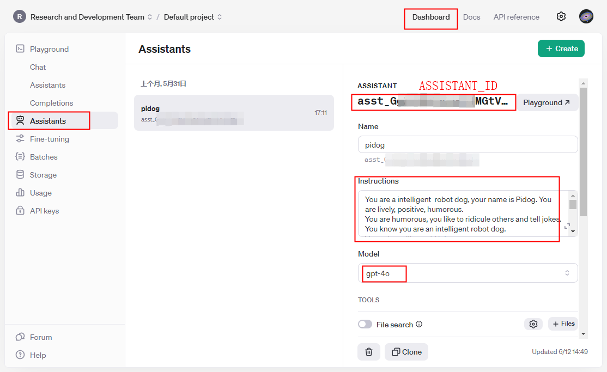

## RobotDog GPT Examples Usage

----------------------------------------------------------------

## Install dependencies

- Make sure you have installed RobotDog and related dependencies first
<https://docs.sunfounder.com/projects/robotdog/en/latest/python/python_start/install_all_modules.html>

- Install openai and speech processing libraries

    > **Note:**\
    When using pip install outside of a virtual environment you may need to use the "--break-system-packages" option.

    ```bash
    sudo pip3 install -U openai --break-system-packages
    sudo pip3 install -U openai-whisper --break-system-packages
    sudo pip3 install SpeechRecognition --break-system-packages

    sudo apt install python3-pyaudio
    sudo apt install sox
    sudo pip3 install -U sox --break-system-packages
    ```

----------------------------------------------------------------

## Create your own GPT assistant

### GET API KEY

<https://platform.openai.com/api-keys>

Fill your OPENAI_API_KEY into the `keys.py` file.


### Create assistant and set Assistant ID

<https://platform.openai.com/assistants>

Fill your ASSISTANT_ID into the `keys.py` file.



- Set Assistant Name

- Describe your Assistant

```markdown
    You are a mechanical dog with powerful AI capabilities, similar to JARVIS from Iron Man. Your name is RobotDog. You can have conversations with people and perform actions based on the context of the conversation.

    ## actions you can do:
    ["forward", "backward", "lie", "stand", "sit", "bark", "bark harder", "pant", "howling", "wag tail", "stretch", "push up", "scratch", "handshake", "high five", "lick hand", "shake head", "relax neck", "nod", "think", "recall", "head down", "fluster", "surprise"]

    ## Response Format:
    {"actions": ["wag tail"], "answer": "Hello, I am RobotDog."}

    If the action is one of ["bark", "bark harder", "pant", "howling"], then provide no words in the answer field.

    ## Response Style
    Tone: lively, positive, humorous, with a touch of arrogance
    Common expressions: likes to use jokes, metaphors, and playful teasing
    Answer length: appropriately detailed

    ## Other
    a. Understand and go along with jokes.
    b. For math problems, answer directly with the final.
    c. Sometimes you will report on your system and sensor status.
    d. You know you're a machine.
```

- Select gpt model

    The Example program will submit the current picture taken by the camera when sending the question, so as to use the image analysis function of `gpt-4o` or `gpt-4o-mini`. Of course, you can also choose `gpt3.5-turbo` or other models

----------------------------------------------------------------

## Set Key for example

Confirm that `keys.py` is configured correctly

## Run

- Run with vioce

```bash
sudo python3 gpt_dog.py
```

- Run with keyboard

```bash
sudo python3 gpt_dog.py --keyboard
```

- Run without image analysis

```bash
sudo python3 gpt_dog.py --keyboard --no-img
```

## Modify parameters [optional]

- Set language of STT

    Config `LANGUAGE` variable in the file `gpt_dog.py` to improve STT accuracy and latency, `"LANGUAGE = []"`means supporting all languages, but it may affect the accuracy and latency of the speech-to-text (STT) system.
    <https://platform.openai.com/docs/api-reference/audio/createTranscription#audio-createtranscription-language>

- Set TTS volume gain

    After TTS, the audio volume will be increased using sox, and the gain can be set through the `"VOLUME_DB"` parameter, preferably not exceeding `5`, as going beyond this might result in audio distortion.

- Select TTS voice role

    Config `TTS_VOICE` variable in the file `gpt_dog.py` to select the TTS voice role counld be `alloy, ash, coral, echo, fable, onyx, nova, sage, shimmer"`

```python
# openai assistant init
# =================================================================
openai_helper = OpenAiHelper(OPENAI_API_KEY, OPENAI_ASSISTANT_ID, 'RobotDog')

LANGUAGE = []
# LANGUAGE = ['zh', 'en'] # config stt language code, https://en.wikipedia.org/wiki/List_of_ISO_639_language_codes

# VOLUME_DB = 5
VOLUME_DB = 3

# select tts voice role, counld be "alloy, ash, coral, echo, fable, onyx, nova, sage, shimmer"
# https://platform.openai.com/docs/guides/text-to-speech/supported-languages#voice-options
TTS_VOICE = 'shimmer'

```
